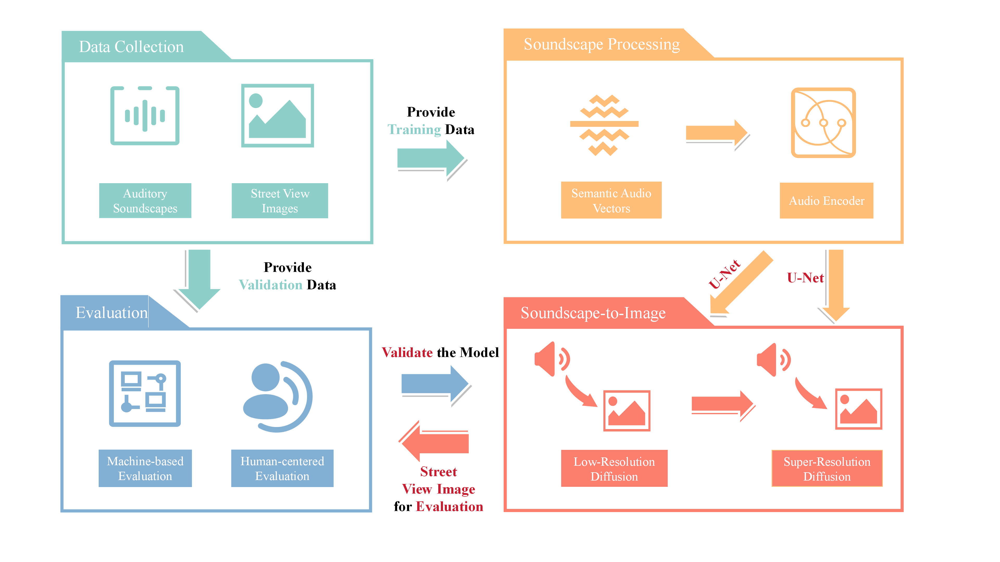

<br />
<p align="center">
  <h2 align="center">From Hearing to Seeing: Linking Auditory and Visual Place Perceptions with Soundscape-to-Image Generative Artificial Intelligence</h2>
</p>

 <p align="center">
    
</p>


## Media Coverage
* KUT Radio: https://www.kut.org/science/2024-12-12/university-of-texas-research-artificial-intelligence-sound-images

* KXAN Austin: https://www.kxan.com/news/local/austin/can-ai-visualize-an-environment-from-sounds-ut-researchers-put-it-to-the-test/

* AOL: https://www.aol.com/ai-visualize-environment-sounds-ut-170110588.html

* TPR: https://www.tpr.org/science-technology/2024-12-13/ut-austin-professor-uses-ai-to-turn-soundscapes-into-landscapes

* New Atlas: https://newatlas.com/ai-humanoids/ai-street-images-sound/

* Austin Journal: https://austinjournal.com/stories/666193521-ai-converts-sound-into-street-view-images-using-new-generative-technology

* Inavate: https://www.inavateonthenet.net/news/article/researchers-use-ai-to-turn-sounds-into-images

* PetaPixel: https://petapixel.com/2024/12/03/ai-generates-accurate-images-of-streets-from-sound-recordings/

* TALANOA 'O TONGA: https://talanoaotonga.to/ai-turns-street-sounds-into-realistic-images-with-remarkable-accuracy/

* Videomaker: https://www.videomaker.com/news/ai-generates-accurate-street-images-from-only-sound-recordings/


## Table of Contents

* [Citation](#citation)
* [About the Project](#about-the-project)
* [Code Usage](#code-usage)
* [Folder Structure](#folder-structure)
* [Contact](#contact)

<!-- Citation -->
## Citation
If you use this algorithm in your research or applications, please cite this source:

Zhuang, Y., Kang, Y., Fei, T., Bian, M. and Du, Y., 2024. From hearing to seeing: Linking auditory and visual place perceptions with soundscape-to-image generative artificial intelligence. Computers, Environment and Urban Systems, 110, p.102122. https://www.sciencedirect.com/science/article/abs/pii/S0198971524000516
```
@article{ZHUANG2024102122,
title = {From hearing to seeing: Linking auditory and visual place perceptions with soundscape-to-image generative artificial intelligence},
journal = {Computers, Environment and Urban Systems},
volume = {110},
pages = {102122},
year = {2024},
issn = {0198-9715},
doi = {https://doi.org/10.1016/j.compenvurbsys.2024.102122},
url = {https://www.sciencedirect.com/science/article/pii/S0198971524000516},
author = {Yonggai Zhuang and Yuhao Kang and Teng Fei and Meng Bian and Yunyan Du},
keywords = {Soundscape, Street view images, Sense of place, Stable diffusion, Generative AI, LLMs},
}
```


<!-- ABOUT THE PROJECT -->
## About The Project

People experience the world through multiple senses simultaneously, contributing to our sense of place. Prior quantitative geography studies have mostly emphasized human visual perceptions, neglecting human auditory perceptions at place due to the challenges in characterizing the acoustic environment vividly. Also, few studies have synthesized the two-dimensional (auditory and visual) perceptions in understanding human sense of place. To bridge these gaps, we propose a Soundscape-to-Image Stable Diffusion model, a generative Artificial Intelligence (AI) model supported by Large Language Models (LLMs), aiming to visualize soundscapes through the generation of street view images. By creating audio-image pairs, acoustic environments are first represented as high-dimensional semantic audio vectors. Our proposed Soundscape-to-Image Stable Diffusion model, which contains a Low-Resolution Diffusion Model and a Super-Resolution Diffusion Model, can then translate those semantic audio vectors into visual representations of place effectively. We evaluated our proposed model by using both machine-based and human-centered approaches and proved that the generated street view images align with our common perceptions, and accurately create several key street elements of the original soundscapes. It also demonstrates that soundscapes provide sufficient visual information places. This study stands at the forefront of the intersection between generative AI and human geography, demonstrating how human multi-sensory experiences can be linked. We aim to enrich geospatial data science and AI studies with human experiences. It has the potential to inform multiple domains such as human geography, environmental psychology, and urban design and planning, as well as advancing our knowledge of human-environment relationships. 

 <p align="center">
    
</p>


 ## Environment


1. Environment: Python 3.9 or newer  

2. Install denpendency 
```bash
  pip install -r requirements.txt
  ```
 
## Pre-trained Audio Encoder
We recommend using our pre-trained audio encoder.
Please download [wlc.pt](https://drive.google.com/file/d/1QsF_tdm5Vk-qQ8kxfAAMs-xjKMDSpl5x/view?usp=drive_link) before starting training or inference.
## Data Management
1. Place your training audio dataset and image dataset in the respective directories.
2. Ensure that paired audio and image files share the same filename. Here’s an example:
```
|-- data
|   |-- audio
|      |-- example_1.wav
|      |-- example_2.wav
|   |-- image
|      |-- example_1.jpg
|      |-- example_2.jpg
```

## Train Model
<!-- 1. install imagen_pytorch, change its diffusion decoder max_text_len into 343,change max_seq_len into 768 !-->
You can easily train the Soundscape-to-image model by run [train.py](/train.py). 
Our model consists of two U-Net networks, which need to be trained separately. Therefore, you must run [train.py](/train.py) at least twice, once for each U-Net.
Usage:
```
python train.py --train-image-path [PATH_TO_IMAGE_DATASET] --train-audio-path [PATH_TO_AUDIO_DATASET] --pre-trained-audio-encoder [PATH_TO_PRETRAINED_AUDIO_ENCODER] --checkpoint-path [PATH_TO_SAVE_CHECKPOINTS] --batch-size [BATCH_SIZE] --epochs [NUMBER_OF_EPOCHS] --lr-unet [LEARNING_RATE] --train-unet-number [UNET_MODEL_INDEX] --save-every [SAVE_FREQUENCY] --continue-unet-ckpt [PATH_TO_CHECKPOINT]

```


<pre>
--train-image-path <span style="color:red">Path to the directory containing the training images.</span>

--train-audio-path <span style="color:red">Path to the directory containing the training audio files.</span>

--pre-trained-audio-encoder <span style="color:red">Path to the pre-trained audio encoder model file (e.g., wlc.pt).</span>

--checkpoint-path <span style="color:red">Directory where model checkpoints will be saved.</span>

--batch-size 5 <span style="color:red">Number of samples processed per batch during training.</span>

--epochs 30 <span style="color:red">Total number of training epochs.</span>

--lr-unet 1e-4 <span style="color:red">Learning rate for the U-Net models.</span>

--train-unet-number 1 <span style="color:red">Specify which U-Net model to train (1 or 2).</span>

--save-every 1 <span style="color:red">Frequency (in epochs) to save model checkpoints.</span>
</pre>


Example:
```
python train.py --train-image-path ./data/image --train-audio-path ./data/audio --pre-trained-audio-encoder ./wlc.pt --checkpoint-path ./checkpoints --batch-size 5 --epochs 30 --lr-unet 1e-4 --train-unet-number 1 --save-every 1
```

If training was interrupted, you can resume it using:
```
--continue-unet-ckpt ./checkpoints/imagen_1_10_epochs.pt
```

Example:
```
python train.py --train-image-path ./data/image --train-audio-path ./data/audio --pre-trained-audio-encoder ./wlc.pt --checkpoint-path ./checkpoints --batch-size 5 --epochs 30 --lr-unet 1e-4 --train-unet-number 1 --save-every 1 --continue-unet-ckpt ./checkpoints/imagen_1_10_epochs.pt
```


## Interference
After training, you can test or apply the model by running [sample.py](sample.py).


Usage:
```
python inference.py --audio-enconder-ckpt [PATH_TO_AUDIO_ENCODER_CKPT] --unet-ckpt [PATH_TO_UNET_CKPT] --test-audio-path [PATH_TO_TEST_AUDIO] --test-image-path [PATH_TO_OUTPUT_IMAGES] --cond-scale [CONDITION_SCALE]
```

<pre> 
--audio-enconder-ckpt <span style="color:red">Path to the pre-trained audio encoder checkpoint (e.g., ./wlc.pt).</span> 
--unet-ckpt  <span style="color:red">Path to the trained U-Net model checkpoint (e.g., ./checkpoints/imagen_1_30_epochs.pt).</span> 
--test-audio-path <span style="color:red">Directory containing test audio files (e.g., ./test_audio).</span> 
--test-image-path <span style="color:red">Directory where generated images will be saved (e.g., ./generated_images).</span> 
--cond-scale <span style="color:red">Controls how strongly the model adheres to the audio features (default: 1.0).</span> </pre>

Example:
```
python inference.py --audio-enconder-ckpt ./wlc.pt --unet-ckpt ./checkpoints/imagen_1_30_epochs.pt --test-audio-path ./test_audio --test-image-path ./generated_images --cond-scale 1.0
```

## Folder Structure
The following folders and files are key components of our project. Please do not delete or move them.

torchvggish → Our audio encoder used for extracting audio embeddings.

imagen_pytorch → Our image generation module, based on Imagen. We have modified some parameters, so you do not need to install the original Imagen separately.
```
project
|-- torchvggish
|-- imagen_pytorch
|-- train.py
|-- sample.py
```

## Contact

Yonggai Zhuang: start128@163.com

Junbo Wang: bbojunbo@gmail.com

Yuhao Kang: yuhao.kang@austin.utexas.edu